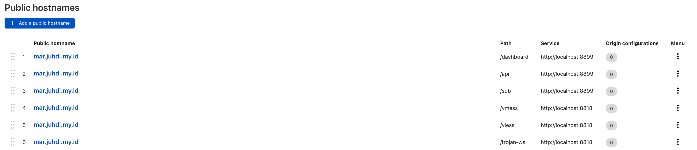
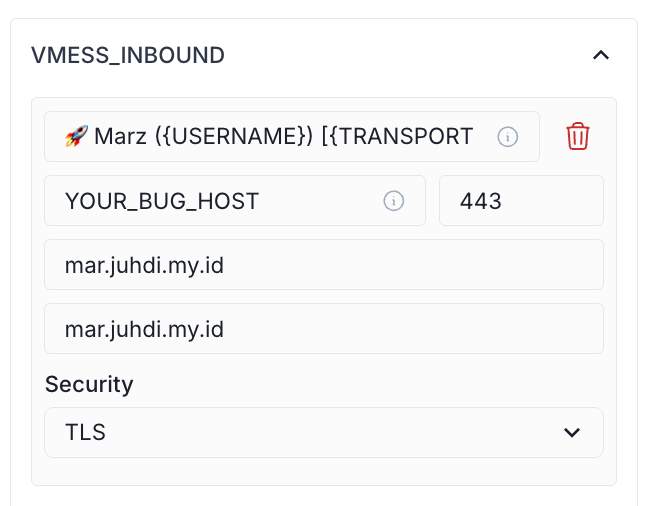
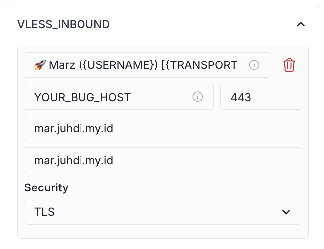
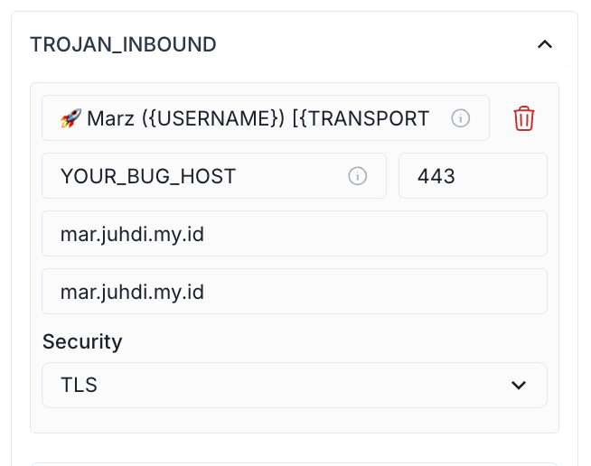

## 🧩 Marzban + Nginx

**Marzban + Nginx Reverse Proxy** in Docker 🐳

This repository provides a complete setup using **Docker Compose** to run [Marzban](https://github.com/Gozargah/Marzban) (an Xray management panel) with **Nginx reverse proxy** and **SSL certificate** support.

---

### ✨ Features

* 🔐 Nginx reverse proxy for managing VMess, VLESS, Trojan, and Shadowsocks traffic
* 📊 Marzban panel accessible via a public port (`8899`)
* 🌐 Xray protocol access only via reverse proxy (no raw port exposure)
* 📦 Persistent configuration to ensure data remains safe even after `docker compose down`
* 🔧 Compatible with servers without public IPs, optionally integrates with **Cloudflare Tunnel**

---

### 📁 Folder Structure

```
.
├── docker-compose.yml         # Main Docker Compose file
├── nginx.conf                 # Main Nginx configuration
├── xray.conf                  # Reverse proxy virtual host for all protocols
├── marzban/                
│   └── xray_config.json       # Xray configuration (VMess, VLESS, etc.)
```

---

### 🚀 How to Use

```bash
git clone https://github.com/yourname/marzban-nginx.git
cd marzban-nginx
docker compose up -d
```

* Access Marzban panel: `http://YOUR-SERVER-IP:8899`
* Access Xray protocols via proxy paths like `/vmess`, `/vless`, etc.

---

## ☁️ Secure & Easy Access to Marzban via Cloudflare Tunnel

Want to access your **Marzban panel** securely without exposing ports? Use **Cloudflare Tunnel** with a subpath like:

### 🌐 Example:



Access Marzban at:

```
https://YOUR_DOMAIN/dashboard
```

---

### ⚙️ Marzban Panel Settings Example:

| VMESS                                          | VLESS                                          | TROJAN                                         |
| ---------------------------------------------- | ---------------------------------------------- | ---------------------------------------------- |
|  |  |  |

---

### ✨ Benefits:

* 🔒 **Secure**: No need to expose port 80/443 publicly
* ☁️ **Reliable**: Leverages Cloudflare’s infrastructure — perfect for servers without public IPs
* 🎯 **Custom Path**: Run the panel under a subpath like `/dashboard`
* 💡 **Cost-Effective**: No need for static IP or premium VPS

---

### 🙏 Special Thanks

This project was inspired by and greatly benefited from:

🔗 **[Agunxzzz/MarXray](https://github.com/Agunxzzz/MarXray/tree/main)**

An excellent repository that provides a full setup of Marzban + Nginx + Xray, helping lay the foundation for this project’s automatic integration and robust reverse proxy structure.

---

> Thanks to the open-source community for continuously strengthening the Xray and Marzban ecosystem! 💪🚀

---
